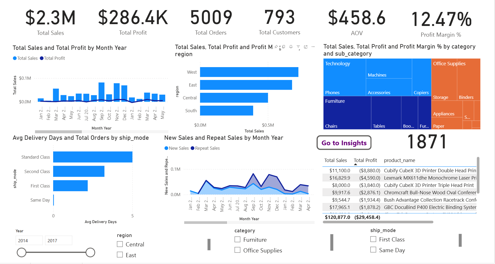
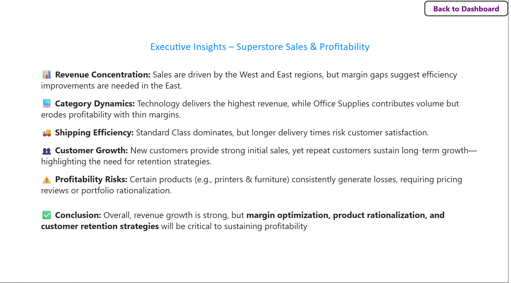

---

## 🔑 Process
1. **Data Preparation**
   
   - Imported `Sample - Superstore.csv` into PostgreSQL.  
   - Cleaned dates, numeric values, and special characters.  
   - Designed table schema with proper data types.  

3. **Modeling**

   - Built a **Calendar table** for time intelligence.  
   - Established relationships (`Calendar[Date] → Orders[Order_Date]`).  
   - Created core measures: Total Sales, Profit, Orders, Customers, AOV, Profit Margin %, Sales YoY %.  

5. **Visualization**

   - Designed 2 Power BI pages:  
     - **Page 1:** Executive Dashboard (KPIs, trends, region, category, shipping, customers).  
     - **Page 2:** Executive Insights (business summary & key recommendations).  

---

## 📊 Dashboard Preview

### Page 1 – Executive Dashboard

### Page 2 – Insights Summary

---

## 📈 Key Insights
- 📊 **Revenue Concentration:** Sales are driven by the West and East regions, but margin gaps suggest efficiency improvements are needed in the East.  
- 💻 **Category Dynamics:** Technology delivers the highest revenue, while Office Supplies contributes volume but erodes profitability with thin margins.  
- 🚚 **Shipping Efficiency:** Standard Class dominates, but longer delivery times risk customer satisfaction.  
- 👥 **Customer Growth:** New customers provide strong initial sales, yet repeat customers sustain long-term growth.  
- ⚠️ **Profitability Risks:** Certain products (e.g., printers & furniture) consistently generate losses, requiring pricing reviews or portfolio rationalization.  

---

## 📑 Deliverables
- **SQL Scripts**
 [superstore_sales_queries.sql](sql/superstore_sales_queries.sql)

 **Power BI Files**  
  - [Superstore_Sales_Analysis.pbix](Project2_Sales_&_Revenue_Performance_Dashboard.pbix) 
  - [Superstore_Sales_Analysis.pdf](Sales_&_Revenue_Performance_Dashboard.pdf)

**Business Report**  
  - [Superstore_Analysis_Report.pdf](Superstore_Sales_Analysis_Report.pdf) → Executive report with introduction, process, visuals, insights, and conclusion
  - 
- Screenshots for quick preview

  
  

---

## 🏁 Conclusion
This project demonstrates my ability to:  
- **Model and query data in SQL**  
- **Build professional dashboards in Power BI**  
- **Communicate insights in a business-friendly format**  

The result is a portfolio-ready project that mirrors the expectations of a real-world **Data Analyst role**.  

---

📌 *Author: Aniket Sakharkar*  

💼 *Open for opportunities in Data Analytics / Business Intelligence*  
